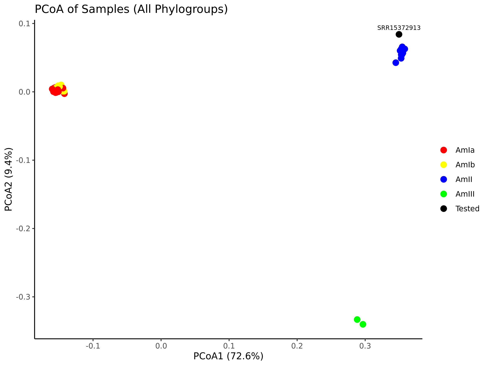
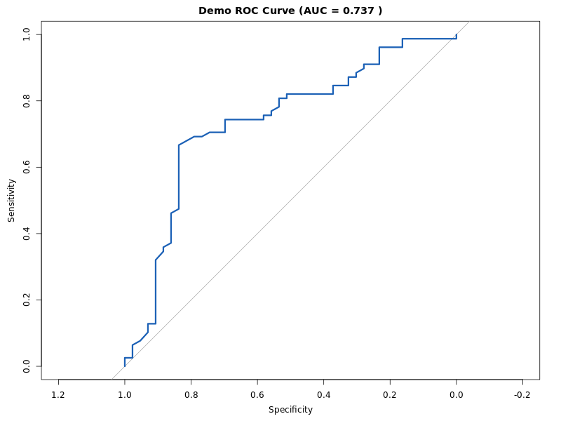

This tool is provided as part of the manuscript "[Predictive power of different *Akkermansia* phylogroups in clinical response to PD-1 blockade against non-small cell lung cancer](https://doi.org/10.1101/2024.08.21.608814)"  and provides two primary modules.


# 🧬 Module 1: Akk Phylo Assign Pipeline

This module provides a simple pipeline for **Akkermansia strain phylogroup assignment** using raw sequencing reads.  
The pipeline runs inside a Docker or Singularity container based on Ubuntu 22.04 with Miniconda and bioinformatics tools installed.

---

## 📋 Requirements

- Docker installed (or Singularity for HPC clusters)
- ~50 GB free disk space
- Internet access for database downloads 

---

## 🚀 Quick Start Guide

### 1. Pull the Docker image

```bash
docker pull fannimi2001/akk_phylo_assign:v1.0
```

### 2. Create required folders

```bash
mkdir -p ./tmp/akk_pipeline_data/rawdata
mkdir -p ./tmp/akk_pipeline_db
```

### 3. Download the Kneaddata database

```bash
curl -L -o kneaddata_db.zip "https://www.dropbox.com/scl/fo/h0oa035ba5qejq73m5n3y/AKyp1oqcLAuwtSxszh7N2o8?rlkey=vvhmbwtgiln1e0i9y9nwyuhus&st=w6z373oz&dl=1"
unzip kneaddata_db.zip -d ./tmp/akk_pipeline_db/
rm kneaddata_db.zip
```

### 4. Download the PanPhlAn database

```bash
curl -L -o panphlan_db.zip "https://www.dropbox.com/scl/fo/py1hi49h1650vpvodl8op/AIQf4LETg5NuvLEFBEjpIgg?rlkey=tf7z35ti9lr9ikqhh5dw2topf&st=qpxi6lc4&dl=0"
unzip panphlan_db.zip -d ./tmp/akk_pipeline_db/
rm panphlan_db.zip
```

### 5. Prepare your raw data and example data

Put raw data (fastq file) in ./tmp/akk_pipeline_data/rawdata

Download the pre-generated example dataset

```shell
curl -L -o  ./tmp/akk_pipeline_data/example_gene_presence_absence.tsv "https://www.dropbox.com/scl/fi/haq847ktwwqjqfnxjwwya/example_gene_presence_absence.tsv?rlkey=yygl3w5vo7roh5458i8iiadh3&st=9xvg3te5&dl=0"

curl -L -o  ./tmp/akk_pipeline_data/reference_phylogroup_metadata.csv "https://www.dropbox.com/scl/fi/d6y08jy9v5qkei49eqy1q/reference_phylogroup_metadata.csv?rlkey=83jyru2zbijfw0raua2rfyckw&st=r40kh8dp&dl=0"

```


### 6. Running the Pipeline

You can run the pipeline with either Docker or Singularity.

### 🔹 Option A: Docker

```bash
docker run --rm -it \
  -v ./tmp/akk_pipeline_data:/pipeline/data \
  -v ./tmp/akk_pipeline_db:/pipeline/DB \
  fannimi2001/akk_phylo_assign:v1.0
```

Inside the container:

```bash
source activate akk_pipeline
# test the pipeline with example dataset
bash akk_phylo_assign/run_tests.sh
# run pipeline on real samples
bash akk_phylo_assign/run_akk_pipeline.sh
```

### 🔹 Option B: Singularity

#### Build the .sif image from Docker Hub

```bash
singularity build akk_phylo_assign.sif docker://fannimi2001/akk_phylo_assign:v1.0
```

#### Run and execute

```bash
singularity shell \
  -B ./tmp/akk_pipeline_data:/pipeline/data \
  -B ./tmp/akk_pipeline_db:/pipeline/DB \
  akk_phylo_assign.sif

source activate akk_pipeline
# test the pipeline with example dataset
bash akk_phylo_assign/run_tests.sh
# run pipeline on real samples
bash akk_phylo_assign/run_akk_pipeline.sh
```

> 📂 Output files are saved in: `./tmp/akk_pipeline_data`


---

## 🔬 Pipeline Workflow and Example Results

- Remove host contaminants with Kneaddata
- Map reads to Akkermansia pangenome using PanPhlAn
- Profile gene presence/absence matrix
- Cluster samples and assign phylogroups
- Visualize sample relationships using PCoA

---

### Example Output

Below is an example of the phylogroup assignment and the PCoA (Principal Coordinate Analysis) plot generated by the pipeline. Each point represents a sample, colored according to its assigned phylogroup based on hierarchical clustering of the gene presence/absence matrix.

Tested (non-reference) samples are highlighted in black, with their sample names labeled. In this example, the tested sample was assigned to the **AmII** phylogroup. Reference genomes (REF samples) were used to guide the phylogroup assignment but are not labeled in the plot.

---




---

## ⚠️ Notes

- You must manually download databases before running the pipeline.
- Kneaddata DB must go to `/pipeline/DB/kneaddata_db`
- PanPhlAn DB must go to `/pipeline/DB/panphlan_db`
- The Docker image does not include database files.
- All inputs/outputs are stored in the mounted `./tmp/akk_pipeline_data` folder.

---


# 🧬 Module 2: RF Model Pipeline for Anti-PD1 Response Prediction

This module provides a containerized workflow for training random forest models using Akkermansia gene features and metadata to predict anti-PD1 response.

---
##  📋 Requirements

- Docker installed (or Singularity for HPC clusters)
- ~50 GB free disk space
- Internet access for database downloads and SRA retrieval
- Reformatted CSV file combining metadata and gene presence (wide format)

---
## 🚀 Quick Start Guide

### 1. Pull the Docker Image

```bash
docker pull fannimi2001/akk_gene_antipd1_ml:v1.1
```

### 2. Prepare your raw data and example data

Download the pre-generated example dataset

```shell
curl -L -o  All_Patients_Strict_Akk_Gene.csv "https://www.dropbox.com/scl/fi/zdzwv9y020kxk757y7x1e/All_Patients_Strict_Akk_Gene.csv?rlkey=g0coux0n6nhsu7pqdq73qt93x&st=xjd0qys0&dl=0"

curl -L -o  Importance_score.csv "https://www.dropbox.com/scl/fi/3llm8jt9rrx5lpb63uqei/Importance_score.csv?rlkey=l5a2jeoqev4uw50cbr8uhrpsh&st=pcp1hi81&dl=0"
```


### 3. Running the Pipeline

### 🔹 Option A: Docker

**Model 1: Training dataset: C1+C2+C3 cohort without High Akk samples**; **Test dataset:C4 cohort**

```bash
docker run --rm -v "$PWD":/data fannimi2001/akk_gene_antipd1_ml:v1.1 \
  --input /data/All_Patients_Strict_Akk_Gene.csv --mode ML1 --threads 8
```

**Model 2: Training dataset: C1+C2+C3 cohort without High Akk and LIGNE=1 samples ; Test dataset:C4 cohort without LIGNE=1 sample**

```bash
docker run --rm -v "$PWD":/data fannimi2001/akk_gene_antipd1_ml:v1.1 \
  --input /data/All_Patients_Strict_Akk_Gene.csv --mode ML2 --threads 8
```

**Model 3: Training dataset: C1+C2+C3+C4 cohort without High Akk samples; No external test, evaluated using LOOCV**

```bash
docker run --rm -v "$PWD":/data fannimi2001/akk_gene_antipd1_ml:v1.1 \
  --input /data/All_Patients_Strict_Akk_Gene.csv --mode ML3 --threads 8
```

**Quick demo**

```bash
docker run --rm -v "$PWD":/data fannimi2001/akk_gene_antipd1_ml:v1.1 \
  --input /data/All_Patients_Strict_Akk_Gene.csv --mode ML1 --threads 8 --test
```


### 🔹 Option B: Singularity

If you're working on an HPC or system that uses Singularity:

### Build the .sif image from Docker Hub
```bash
singularity build rf_model_pipeline.sif docker://fannimi2001/akk_gene_antipd1_ml:v1.1
```


### Run and execute
```bash
**Model 1**
singularity run --bind "$PWD":/data rf_model_pipeline.sif \
  --input /data/All_Patients_Strict_Akk_Gene.csv --mode ML1 --threads 8

**Model 2**
singularity run --bind "$PWD":/data rf_model_pipeline.sif \
  --input /data/All_Patients_Strict_Akk_Gene.csv --mode ML2 --threads 8

**Model 3**
singularity run --bind "$PWD":/data rf_model_pipeline.sif \
  --input /data/All_Patients_Strict_Akk_Gene.csv --mode ML3 --threads 8

**Quick demo**
singularity run --bind "$PWD":/data rf_model_pipeline.sif \
  --input /data/All_Patients_Strict_Akk_Gene.csv --mode ML1 --threads 8 --test

```

> 📂 Output files are saved in current working directory.
---


## 🔬 Pipeline Workflow and Example Results

- Preprocess microbiome feature tables and sample metadata
- Define training/testing splits based on modeling mode
- Train Random Forest models using LOOCV and hyperparameter tuning
- Evaluate models with ROC curves and calculate AUC
- Save trained models and feature importance rankings
- Summarize model performance (best AUC and tuning parameters)
---
### Example Output

| Output File                     | Description                                                  |
| :------------------------------ | :----------------------------------------------------------- |
| `fit_<mode>_TL50_test.rds`      | Trained Random Forest model (quick test, using only top 50 important genes) |
| `model_summary_<mode>_test.csv` | Model summary, including best TuneLength (TL=50) and resulting AUC |
| `demo_ROC_curve_<mode>.png`     | ROC curve image showing model classification performance on training data |

The figure below shows the ROC curve obtained from a quick test run using the Random Forest pipeline. The model was trained on all samples using only the top 50 precomputed important genes. An AUC (Area Under the Curve) value is 0.737 indicates good model performance.  
This quick test mode is designed to verify pipeline functionality without full resource usage.

---



---


## ⚠️ Notes

- The input table must be properly formatted with metadata rows followed by gene presence/absence matrix.
- A precomputed importance table (`Importance_score.csv`) is required for quick test mode.
- Test run outputs are automatically distinguished with `_test` suffixes to avoid confusion with real models.
- Estimated runtime:
  - Quick test mode: ~5–10 minutes depending on machine
  - Full training mode: several hours depending on dataset size and number of threads

---

## Citations

Peixin Fan, Mi Ni, Yu Fan, Magdalena Ksiezarek, Gang Fang. Predictive power of different *Akkermansia* phylogroups in clinical response to PD-1 blockade against non-small cell lung cancer. bioRxiv 2024.08.21.608814; doi: https://doi.org/10.1101/2024.08.21.608814


